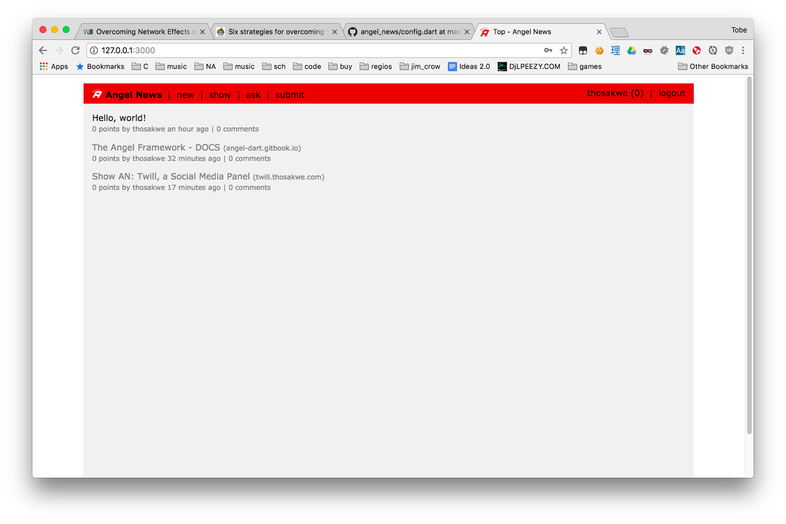

# angel_news
A HackerNews clone using Angel and Jael.



# Running the Project
This project should be ready-to-go right out of the box, as care was taken to use
backwards-compatible code, and `package:angel_file_service` is used, instead of any
specific database.

All you need to is:

```bash
$ git clone --depth 1 https://github.com/angel-example/angel_news.git
$ cd angel_news
$ pub get
$ dart bin/server.dart
```

And then, just visit http://localhost:3000 to see it in action!